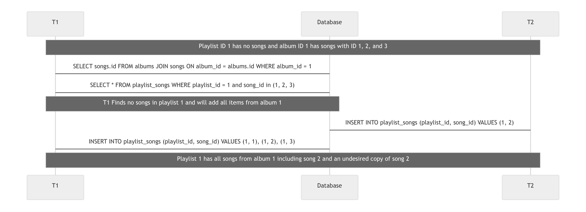

## Case 1
### Description
A non-repeatable read could occur in the advanced playlist creation because of its dependency on average song rating.
The initial query in the advanced playlist creation returns only songs that have above a 4.0 rating in a given feedback category. If this query is made,
then a separate transaction submits feedback that drops the song's average rating below 4.0, the service will still place this song in the playlist
despite it having a rating that is too low.
### Diagram

## Case 2
### Description
A phantom read could occur in the get new releases function because it depends on the user preferences table. If a user deletes one of their preferences in between the stages of fetching preferences and generating recommendations, the result will contain their original preferences instead of their new ones.
### Diagram

## Case 3
### Description
A user has a new personal playlist and shares their account with a friend. The two have decided to build this new playlist together, each adding songs they like. A phantom read could occur when the two are adding songs to the playlist at the same time. This could occur if `/playlists/{playlist_id}/add-song/{song_id}` and `/playlist/{playlist_id}/add-songs/{album_id}` happen at the same time with a song_id that is contained in the album. When adding an entire album to a playlist, only songs that don’t already exist in the playlist are added. If `add_album_songs_to_playlist` transaction begins and starts to add all songs in an album because it finds that none of them exists already in the playlist and at the same time `add_song_to_playlist` is called then that song could be added twice to the playlist. Our implementation actually checks for songs and inserts them in a single query to solve unexpected behavior like this.
### Diagram

